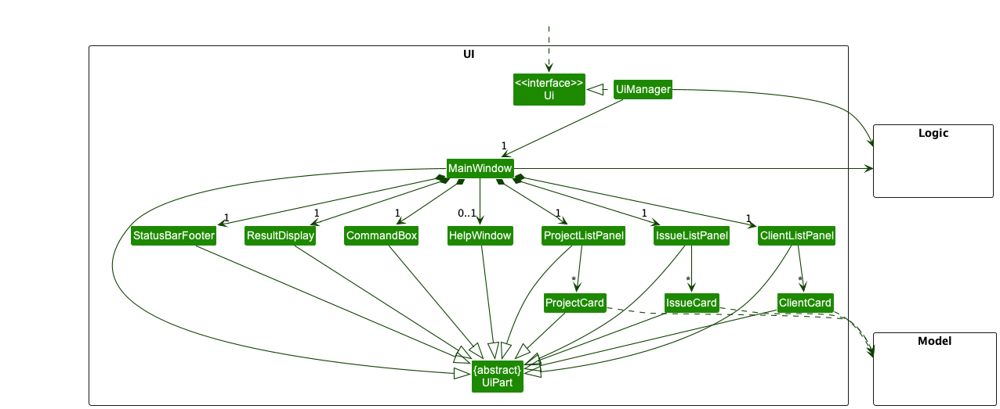
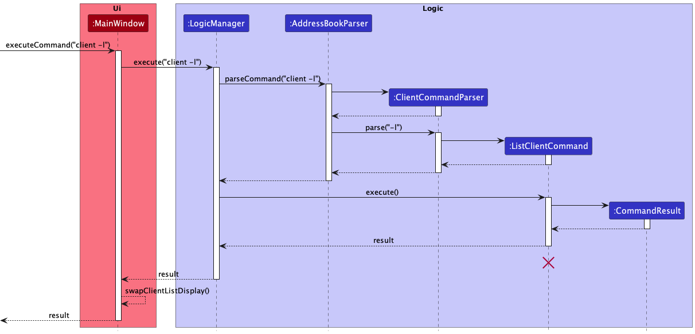
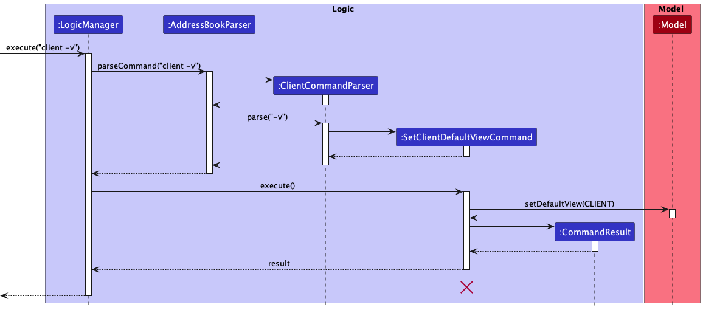
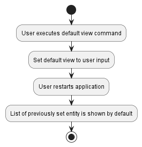
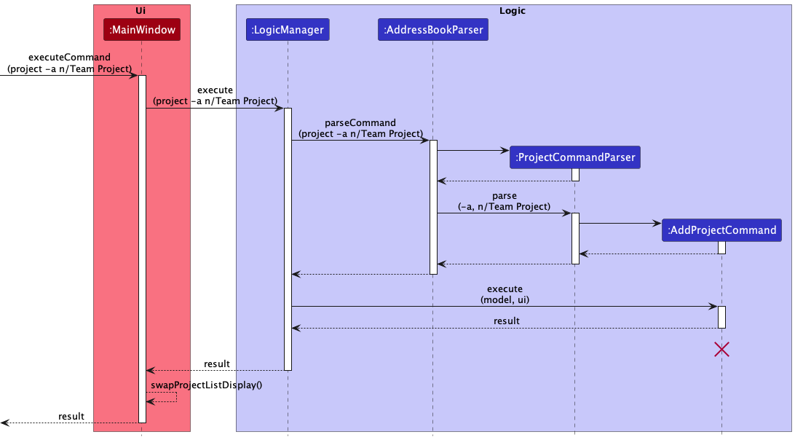
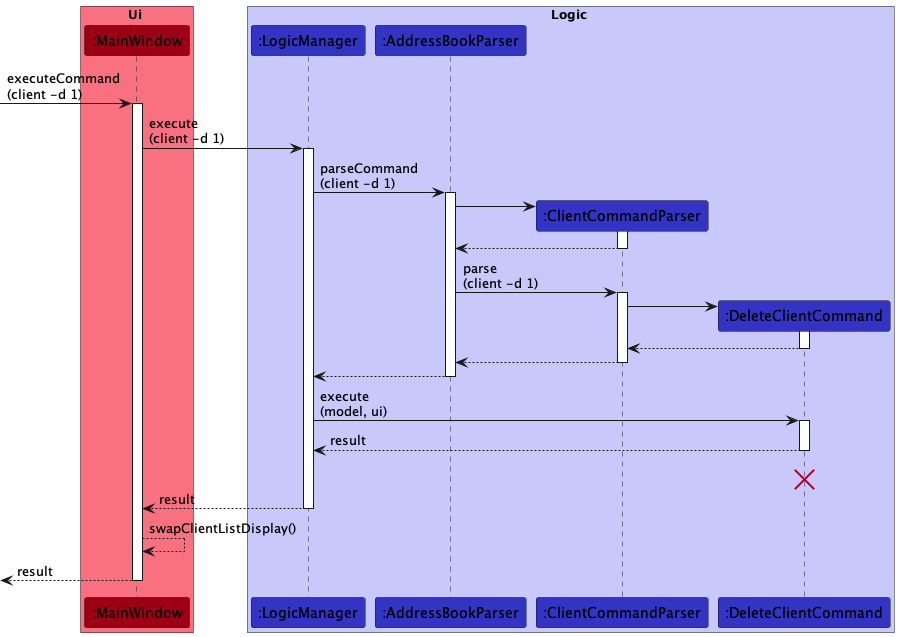
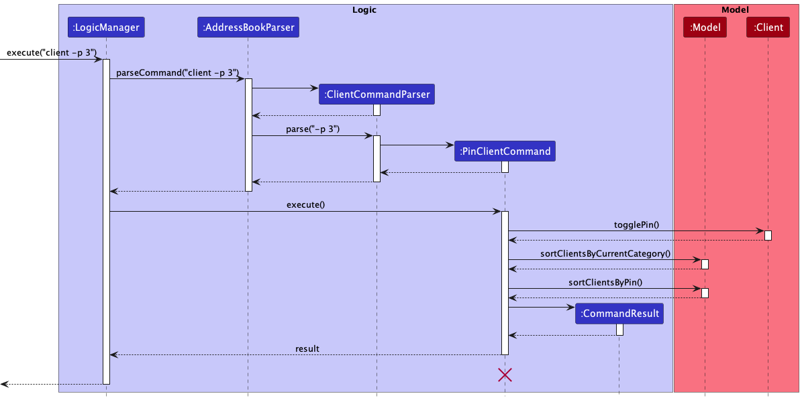
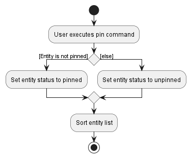

* Table of Contents
{:toc}

---

## **Acknowledgements**

- This project is based on the AddressBook-Level3 project created by the [SE-EDU initiative](https://se-education.org).

--------------------------------------------------------------------------------------------------------------------

## **Setting up, getting started**

Refer to the guide [_Setting up and getting started_](SettingUp.md).

--------------------------------------------------------------------------------------------------------------------

## **Design**

:bulb: **Tip:** The `.puml` files used to create diagrams in this document can be found in the [diagrams](https://github.com/se-edu/addressbook-level3/tree/master/docs/diagrams/) folder. Refer to the [_PlantUML Tutorial_ at se-edu/guides](https://se-education.org/guides/tutorials/plantUml.html) to learn how to create and edit diagrams.

### Architecture

The ***Architecture Diagram*** given above explains the high-level design of the App.

Given below is a quick overview of main components and how they interact with each other.

**Main components of the architecture**

**`Main`** has two classes called [`Main`](https://github.com/se-edu/addressbook-level3/tree/master/src/main/java/seedu/address/Main.java) and [`MainApp`](https://github.com/se-edu/addressbook-level3/tree/master/src/main/java/seedu/address/MainApp.java). It is responsible for,
* At app launch: Initializes the components in the correct sequence, and connects them up with each other.
* At shut down: Shuts down the components and invokes cleanup methods where necessary.

[**`Commons`**](#common-classes) represents a collection of classes used by multiple other components.

The rest of the App consists of four components.

* [**`UI`**](#ui-component): The UI of the App.
* [**`Logic`**](#logic-component): The command executor.
* [**`Model`**](#model-component): Holds the data of the App in memory.
* [**`Storage`**](#storage-component): Reads data from, and writes data to, the hard disk.

**How the architecture components interact with each other**

The *Sequence Diagram* below shows how the components interact with each other for the scenario where the user issues the command `delete 1`.

Each of the four main components (also shown in the diagram above),

* defines its *API* in an `interface` with the same name as the Component.
* implements its functionality using a concrete `{Component Name}Manager` class (which follows the corresponding API `interface` mentioned in the previous point.

For example, the `Logic` component defines its API in the `Logic.java` interface and implements its functionality using the `LogicManager.java` class which follows the `Logic` interface. Other components interact with a given component through its interface rather than the concrete class (reason: to prevent outside component's being coupled to the implementation of a component), as illustrated in the (partial) class diagram below.

The sections below give more details of each component.

### UI component

The **API** of this component is specified in [`Ui.java`](https://github.com/se-edu/addressbook-level3/tree/master/src/main/java/seedu/address/ui/Ui.java)

The UI consists of a `MainWindow` that is made up of parts e.g.`CommandBox`, `ResultDisplay`, `PersonListPanel`, `StatusBarFooter` etc. All these, including the `MainWindow`, inherit from the abstract `UiPart` class which captures the commonalities between classes that represent parts of the visible GUI.

The `UI` component uses the JavaFx UI framework. The layout of these UI parts are defined in matching `.fxml` files that are in the `src/main/resources/view` folder. For example, the layout of the [`MainWindow`](https://github.com/se-edu/addressbook-level3/tree/master/src/main/java/seedu/address/ui/MainWindow.java) is specified in [`MainWindow.fxml`](https://github.com/se-edu/addressbook-level3/tree/master/src/main/resources/view/MainWindow.fxml)

The `UI` component,

* executes user commands using the `Logic` component.
* listens for changes to `Model` data so that the UI can be updated with the modified data.
* keeps a reference to the `Logic` component, because the `UI` relies on the `Logic` to execute commands.
* depends on some classes in the `Model` component, as it displays `Person` object residing in the `Model`.

### Logic component

**API** : [`Logic.java`](https://github.com/se-edu/addressbook-level3/tree/master/src/main/java/seedu/address/logic/Logic.java)

Here's a (partial) class diagram of the `Logic` component:

How the `Logic` component works:
1. When `Logic` is called upon to execute a command, it uses the `AddressBookParser` class to parse the user command to result in a `Command` object (more precisely, an object of one of its subclasses e.g., `AddClientCommand`). More specifically,
   1. If the command is specific to an entity (e.g. `Project`, `Client` or `Issue`), this results in a `CommandParser` object (More specifically, an object of one of its subclasses e.g., `ClientCommandParser`)), which then yields a `Command` object.
   2. Otherwise, it results in a `Command` Object directly.
2. The resulting `Command` object is executed by the `LogicManager`.
3. The command can communicate with the `Model` when it is executed (e.g. to add a person).
4. The result of the command execution is encapsulated as a `CommandResult` object which is returned back from `Logic`.

The Sequence Diagram below illustrates the interactions within the `Logic` component for the `execute("delete 1")` API call.

:information_source: **Note:** The lifeline for `DeleteCommandParser` should end at the destroy marker (X) but due to a limitation of PlantUML, the lifeline reaches the end of diagram.

Here are the other classes in `Logic` (omitted from the class diagram above) that are used for parsing a user command:

How the parsing works:
* When called upon to parse a user command, the `AddressBookParser` class creates an `XYZCommandParser` (`XYZ` is a placeholder for the specific command name e.g., `ClientCommandParser`) which uses the other classes shown above to parse the user command and create a `XYZCommand` object (e.g., `AddClientCommand`) which the `AddressBookParser` returns back as a `Command` object.
* All `XYZCommandParser` classes (e.g., `ClientCommandParser`, `IssueCommandParser`, ...) inherit from the `Parser` interface so that they can be treated similarly where possible e.g, during testing.

### Model component
**API** : [`Model.java`](https://github.com/se-edu/addressbook-level3/tree/master/src/main/java/seedu/address/model/Model.java)

The `Model` component,

* stores the project book data i.e., all `Person` objects (which are contained in a `UniquePersonList` object).
* stores the currently 'selected' `Person` objects (e.g., results of a search query) as a separate _filtered_ list which is exposed to outsiders as an unmodifiable `ObservableList<Person>` that can be 'observed' e.g. the UI can be bound to this list so that the UI automatically updates when the data in the list change.
* stores a `UserPref` object that represents the user’s preferences. This is exposed to the outside as a `ReadOnlyUserPref` objects.
* does not depend on any of the other three components (as the `Model` represents data entities of the domain, they should make sense on their own without depending on other components)

:information_source: **Note:** An alternative (arguably, a more OOP) model is given below. It has a `Tag` list in the `AddressBook`, which `Person` references. This allows `AddressBook` to only require one `Tag` object per unique tag, instead of each `Person` needing their own `Tag` objects. 

### Storage component

**API** : [`Storage.java`](https://github.com/AY2223S1-CS2103-F13-1/tp/blob/master/src/main/java/seedu/address/storage/Storage.java)

The `Storage` component,
* can save both project book data and user preference data in json format, and read them back into corresponding objects.
* inherits from both `AddressBookStorage` and `UserPrefStorage`, which means it can be treated as either one (if only the functionality of only one is needed).
* depends on some classes in the `Model` component (because the `Storage` component's job is to save/retrieve objects that belong to the `Model`).
* handles all parsing of objects in `StorageUtil`.

### Common classes

Classes used by multiple components are in the `seedu.addressbook.commons` package.

--------------------------------------------------------------------------------------------------------------------

## **Implementation**

This section describes some details on how certain features are implemented.

### List Feature

The list mechanism is facilitated by `MainWindow`. It contains a `CommandBox` which listens for user command input and a JavaFX `StackPane` which holds the current entity list to be displayed. Upon the execution of either a `ListProjectCommand`, `ListClientCommand` or `ListIssueCommand`, the following operations are carried out:
* `MainWindow#swapProjectListDisplay()` — Changes the current display to a list of projects.
* `MainWindow#swapClientListDisplay()` — Changes the current display to a list of clients.
* `MainWindow#swapIssueListDisplay()` — Changes the current display to a list of issues.

Given below is an example usage scenario and how the list mechanism behaves at each step.

Step 1. The user launches the application for the first time. The `StackPane` will be initialized by default with a list of projects.

Step 2. The user executes `client -l` to view a list of clients. The `ListClientCommand` is executed and calls `MainWindow#swapClientListDisplay()`, clearing the current collection of child nodes of the `StackPane` and adds the root of a `ClientListPanel` to the emptied child nodes. The list of clients is now shown in the UI.

:information_source: **Note:** If the current display is already the same as that requested by the user, it will still call the respective setter methods, although the actual UI display will not change.

The following sequence diagram shows how the list operation works:

:information_source: **Note:** The lifeline for `ListClientCommand`
should end at the destroy marker (X) but due to a limitation of PlantUML, the lifeline reaches the end of diagram.

The following activity diagram summarizes what happens when a user executes a list command:

#### Design considerations:

**Aspect: How list executes:**

* **Alternative 1 (current choice):** The children nodes of the `StackPane` are cleared and the root of the desired list type is added every time a list `Command` is executed.
  * Pros: Easier to implement.
  * Cons: The same `StackPane` is being reused for different entities. Misses out on potential polymorphism benefits.

* **Alternative 2:** The children nodes of the `StackPane` are never cleared and holds a single list of entities (`Project`, `Client`, `Issue`) and the list is filtered for the desired instance type for each list `Command`.
  * Pros: Less duplication of code.
  * Cons: Leads to more `instanceof` checks. Not much common behaviour between the entity classes to be abstracted via polymorphism.

### Default View Feature

The default view mechanism is facilitated by `GuiSettings`. It is stored internally as a `DefaultView` enumeration which can take either of three values, `PROJECT`, `CLIENT` or `ISSUE`. Upon the execution of either a `SetProjectDefaultViewCommand`, `SetClientDefaultViewCommand` or `SetIssueDefaultViewCommand`, the following operation is called:
* `GuiSettings#setDefaultView()` — Sets the default view variable to the specified `DefaultView` type.

This operation is exposed in the Model interface as `Model#setDefaultView()`.

Given below is an example usage scenario and how the default view mechanism behaves at each step.

Step 1. The user launches the application for the first time. The list of projects is shown by default.

Step 2. The user executes `client -v` to set the default view to clients. The `SetClientDefaultViewCommand` is executed and calls `Model#setDefaultView()`, setting the default view to the list of clients.

Step 3. The next time the user launches the application, the list of clients is shown by default.

The following sequence diagram shows how the default view operation works:

:information_source: **Note:** The lifeline for `SetClientDefaultViewCommand`
should end at the destroy marker (X) but due to a limitation of PlantUML, the lifeline reaches the end of diagram.

The following activity diagram summarizes what happens when a user executes a default view command:

  
### Add Command Feature

A key functionality of DevEnable is the ability to add projects, issues, and clients into the system. The command word for adding will be `project`, `issue`, or `client`, depending on which entity is being added.
This is followed by the flag `-a`, representing an Add command. Next, it is followed by a series of prefixes-value pairs to initialise the entity, some of which are compulsory while others are optional.
When a user enters a valid Add command in the interface, `AddressBookParser#parseCommand` will be called which processes the inputs, creates an instance of a command parser, and calls the `ProjectCommandParser#parse`,
`IssueCommandParser#parse` or `ClientCommandParser#parse` method, depending on which entity is being added. Within this method, the flag `-a` will be detected, calling `ProjectCommandParser#parseAddProjectCommand`, 
`IssueCommandParser#parseAddIssueCommand`, or `ClientCommandParser#parseAddClientCommand`, depending on which entity is added, which checks for input and prefix-value pair validity with methods in `ParserUtil`.
Finally, the parsed arguments are passed into and returned in an instance of the Add Command entity and the `AddProjectCommand#execute`, `AddIssueCommand#execute`, or `AddClientCommand#execute` is called depending
on which entity is added, which retrieves the respective entity list from the system, adds the entity into the list to update it, and have the UI display the updated filtered entity list.   

#### Add Project Command
Compulsory prefixes: n/VALID_NAME  
Optional prefixes: c/VALID_CLIENT_ID, r/VALID_REPOSITORY, d/VALID_DEADLINE  
Example Use: `project -a n/John c/1 r/JohnDoe/tp d/2022-03-05`  

#### Add Issue Command
Compulsory prefixes: p/VALID_PROJECT_ID, t/VALID_TITLE  
Optional prefixes: d/VALID_DEADLINE, u/VALID_URGENCY  
Example Use: `issue p/1 t/To create a person class which stores all relevant person data d/2022-12-10 u/0`  

#### Add Client Command
Compulsory prefixes: n/VALID_NAME, p/VALID_PROJECT_ID  
Optional prefixes: m/VALID_MOBILE_NUMBER, e/VALID_EMAIL  
Example Use: `client -a n/John Doe m/98765432 e/johnd@example.com p/1`  

#### The following sequence diagram shows how the add command operation works for adding a project entity:
Example: `project -a n/Team Project`

:information_source: **Note:** The lifeline for `AddProjectCommand` 
should end at destroy marker (X) but due to a limitation of PlantUML, the lifeline reaches the end of diagram.

#### Design considerations:

**Aspect: Add command access to the model:**

**Alternative 1: (current choice)** Only `AddProjectCommand:execute`, `IssueCommandParser:execute` and `ClientCommandParser:execute` have access to the Model.
* Pros: No coupling between Parser class and Model class.
* Cons: Mappings could not be performed within the parser.

**Alternative 2:** Refactor `ProjectCommandParser:parseAddProjectCommand`, `IssueCommandParser:parseAddIssueCommand` and `ClientCommandParser:parseAddClientCommand` to have access to the Model.
 * Pros: Mappings could be performed within the parser which fitted its responsibility.
 * Cons: May result in extra coupling between Parser class and Model class.
 
Taking into consideration the extra coupling involved, Alternative 1 was chosen as the current design for add command access to the model.

### Delete Command Feature

A key functionality of DevEnable is the ability to delete projects, issues, and clients into the system. The command 
word for deleting will be `project`, `issue`, or `client`, depending on which entity is being deleted.
This is followed by the flag `-d`, representing a Delete command. Next, it is followed by a compulsory argument to 
initialise the entity.
When a user enters a valid Delete command in the interface, `AddressBookParser#parseCommand` will be called which 
processes the inputs, creates an instance of a command parser, and calls the `ProjectCommandParser#parse`,
`IssueCommandParser#parse` or `ClientCommandParser#parse` method, depending on which entity is being added. Within 
this method, the flag `-d` will be detected, calling `ProjectCommandParser#parseDeleteProjectCommand`,
`IssueCommandParser#parseDeleteIssueCommand`, or `ClientCommandParser#parseDeleteClientCommand`, depending on which 
entity is deleted, which checks for input argument validity with methods in `ParserUtil`.
Finally, the parsed arguments are passed into and returned in an instance of the Delete Command entity and the 
`DeleteProjectCommand#execute`, `DeleteIssueCommand#execute`, or `AddClientCommand#execute` is called depending
on which entity is deleted, which retrieves the respective entity list from the system, deletes the entity from the 
list to update it, and have the UI display the updated filtered entity list.

#### Delete Project Command
Compulsory prefix: p/VALID_PROJECT_ID  
Example Use: `project -d 1`  

#### Delete Issue Command
Compulsory prefix: i/VALID_ISSUE_ID  
Example Use: `issue -d 2`  

#### Delete Client Command
Compulsory prefix: c/VALID_CLIENT_ID  
Example Use: `client -d 3`  

#### The following sequence diagram shows how the delete command operation works for deleting a client entity:
Example: `client -d 1`

:information_source: **Note:** The lifeline for `DeleteClientCommand` 
should end at destroy marker (X) but due to a limitation of PlantUML, the lifeline reaches the end of diagram.

#### Design considerations:

**Aspect: Delete command access to the model: **

**Alternative 1: (current choice)** Only `ProjectCommand:execute`, `IssueCommandParser:execute` and `ClientCommandParser:execute` have access to the Model.
* Pros: No coupling between Parser class and Model class.
* Cons: Mappings could not be performed within the parser.
*
**Alternative 2: ** Refactor `ProjectCommandParser:parseDeleteProjectCommand`, 
`IssueCommandParser:parseDeleteIssueCommand` and `ClientCommandParser:parseDeleteClientCommand` to have access to 
the Model.
* Pros: Mappings could be performed within the parser which fitted its responsibility.
* Cons: May result in extra coupling between Parser class and Model class.

Taking into consideration the extra coupling involved, Alternative 1 was chosen as the current design for delete command access to the model.

### Edit Command Feature

A key functionality of DevEnable is the ability to edit projects, issues and clients currently in the system. The command word for editing will be `project`, `issue`, or `client`, depending on which entity it being edited.
This is followed by the flag `-e`, representing an Edit command. Next, it is followed by a series of prefixes-value pairs, one compulsory pair for identifying the entity to be edited, and at least one pair indicating the fields to be edited.
When a user enters a valid Edit command in the interface, `AddressBookParser#parseCommand` will be called which processes the inputs, creates an instance and calls the `ProjectCommandParser#parse`, 
`IssueCommandParser#parse` or `ClientCommandParser#parse` method, depending on which entity is being edited. Within this method, the flag `-e` will be detected, calling `ProjectCommandParser#parseEditProjectCommand`, 
`IssueCommandParser#parseEditIssueCommand`, or `ClientCommandParser#parseEditClientCommand`, depending on which entity is edited, which checks for input and prefix-pair validity with methods in `ParserUtil`.
Finally, the parsed arguments are passed into and returned in an instance of the Edit Command entity and the `EditProjectCommand#execute`, `EditIssueCommand#execute`, or `EditClientCommand#execute` is called depending on
which entity is edited, which retrieves the respective entity from its entity list in the system, edits the fields of the entity, updates it, and have the UI display the updated filtered entity list.

#### Edit Project Command
Compulsory prefix: p/VALID_PROJECT_ID  
Optional prefixes (at least one to be included): n/VALID_NAME, c/VALID_CLIENT_ID, r/VALID_REPOSITORY, d/VALID_DEADLINE  
Example Use: `project -e p/1 n/Jeff c/1 r/Jeffrey/tp d/2022-07-05`  

#### Edit Issue Command
Compulsory prefix: i/VALID_ISSUE_ID  
Optional prefixes (at least one to be included): t/VALID_TITLE, d/VALID_DEADLINE, u/VALID_URGENCY  
Example Use: `issue -e i/1 t/To edit issue command d/2022-04-09 u/1`  

#### Edit Client Command
Compulsory prefix: c/VALID_CLIENT_ID  
Optional prefixes (at least one to be included): n/VALID_NAME, m/VALID_MOBILE_NUMBER, e/VALID_EMAIL, p/VALID_PROJECT_ID  
Example Use: `client -e c/1 n/BenTen m/12345678 e/Ben10@gmail.com p/1`  

#### The following sequence diagram shows how the edit command operation works for editing an issue entity:
Example: `issue -e i/1 t/To edit issue command d/2022-04-09 u/1`

#### Design considerations: 

**Aspect: Editing of entity fields:**

**Alternative 1: (current choice)** For each possible field to be edited, a new object of that field, with the parsed argument(if any) or null value, is created in `ProjectCommandParser#parseEditProjectCommand`, `IssueCommandParser#parseEditIssueCommand` or `ClientCommandParser#parseEditClientCommand`, then passed as arguments into `EditProjectCommand`, `EditIssueCommand` or `EditClientCommand`. 
Within `EditProjectCommand#execute`, `EditIssueCommand#execute` and `EditClientCommand#execute`, set the fields to the new field objects.
* Pros: Logic is handled within the parser and no creation of a new entity object.
* Cons: Many new objects being created 

**Alternative 2:** For each possible field to be edited, pass the parsed arguments into `EditProjectCommand`, `EditIssueCommand` or `EditClientCommand`. Within `EditProjectCommand#execute`, `EditIssueCommand#execute` and `EditClientCommand#execute`, access each of the fields and set the parsed arguments as the new parameters.
* Pros: No new objects being created.
* Cons: Requires many steps to access each field and set the value through a setter, logic is also then handled by the commands

**Alternative 3:** For each possible field to be edited, a new object of that field, with the parsed argument(if any) or null value, is created in `ProjectCommandParser#parseEditProjectCommand`, `IssueCommandParser#parseEditIssueCommand` or `ClientCommandParser#parseEditClientCommand`, then passed as arguments into `EditProjectCommand`, `EditIssueCommand` or `EditClientCommand`.
Within `EditProjectCommand#execute`, `EditIssueCommand#execute` and `EditClientCommand#execute`, retrieve the entity to be edited and create a new entity with the new field objects and the original fields not to be edited.
* Pros: Logic is handled within the parser
* Cons: Creation of a new entity object requiring modification of the entity list 

As logic should be handled in the parser and to minimise modifications of the entity list (which could affect entity IDs), Alternative 1 was chosen as the current design for editing the fields of the entity.

### Sort Feature

The sort feature sorts the entities in their respective entity lists in the Model according to a specified `key` and `order`. The View pulls the new entity lists from the Model and displays them. Upon the execution of
either a `SortProjectCommand`, `SortIssueCommand` or `SortClientCommand`, the `AddressBook#sortXXXByYYY()` is invoked (where XXX is the `entity` and YYY is the `key` to be sorted by) which obtains the entity class's 
modifiable `ObservableList` as imported from the JavaFX collections, and calls its `sorted()` method that, depending on the specified `order`, takes in a comparator function specifying how to sort the entities.

#### Sort Project Command
Keys (exactly one key to be included): p, d, i, n  
Orders (exactly one order to be included): 0, 1  
General Form: `project -s KEY/ORDER`  
Example Use: `project -s d/0`  

#### Sort Issue Command
Keys (exactly one key to be included): i, d, u  
Orders (exactly one order to be included): 0, 1  
General Form: `issue -s KEY/ORDER`  
Example Use: `issue -s u/1`  

#### Sort Client Command
Keys (exactly one key to be included): c, n  
Orders (exactly one order to be included): 0, 1  
General Form: `client -s KEY/ORDER`  
Example Use: `client -s c/1`  

#### Design considerations:

**Aspect: How sorted entities are stored in the Model:**

* **Alternative 1 (current choice):** Sort entities directly on their original entity lists. After `SortProjectCommand`, `SortIssueCommand` or `SortClientCommand`, the original entity list gets manipulated and is rendered to the View.
    * Pros: Saves lots of space
    * Cons: Sort commands manipulate the original entity list in order to change the display on view

* **Alternative 2:** Maintain a separate sorted entity list for each entity and their purpose is to store each entity in their sorted order. After `SortProjectCommand`, `SortIssueCommand` or `SortClientCommand`, the respective sorted entity list gets manipulated and is rendered to the View.
    * Pros: The original entity lists will not be affected by manipulations made through sorting in order to change the display on view 
    * Cons: To maintain such a sorted entity list for Project, Issue and Client will take up considerable space
    
Alternative 1 was chosen because it saves space when sorting entities. The command to set default view of each entity helped overcome the cons of directly manipulating of the original list. This meant rebooting the app removed the previous entity sort order and revert to the default order. 

### Pin Feature

The pin mechanism is facilitated by `AddressBook`. It contains a `UniqueEntityList` for each entity type. Upon the execution of either a `PinProjectCommand`, `PinClientCommand` or `PinIssueCommand`, the following operations are carried out:
* `AddressBook#sortProjectsByPin()` — Sorts the current project list according to pin.
* `AddressBook#sortClientsByPin()`, `AddressBook#sortIssuesByPin()` — Similar function as above, but for clients and issues.
* `AddressBook#sortProjectsByCurrentCategory()`  — Sorts the current project list according to the last known sorting category.
* `AddressBook#sortClientsByCurrentCategory()`, `AddressBook#sortIssuesByCurrentCategory()` — Similar function as above, but for clients and issues.

These operations are exposed in the Model interface as methods with the same name e.g. `Model#sortProjectsByPin()`, `Model#sortProjectsByCurrentCategory()`.

Given below is an example usage scenario and how the pin mechanism behaves at each step.

Step 1. The user creates an entity with a unique ID. The entity is unpinned by default and will be displayed according to the current sorting order.

Step 2. The user executes `client -p 3` to pin the 3rd client in the project book. The `PinClientCommand` is executed and calls `togglePinned()`, toggling the `Pin` attribute of the 5th client from `false` to `true`. This is followed by a call to `Model#sortClientsByCurrentCategory()` and `Model#sortClientsByPin()`, which displays the sorted client list with pinned clients (now including the 4th client) at the top.

:information_source: **Note:** If the current client is already pinned, `Client#togglePin()` will toggle the `Pin` attribute of the client from `true` to `false` and call the latest sort order, causing the client to be displayed in its original position.

The following sequence diagram shows how the pin operation works:

:information_source: **Note:** The lifeline for `PinClientCommand`
should end at the destroy marker (X) but due to a limitation of PlantUML, the lifeline reaches the end of diagram.

The following activity diagram summarizes what happens when a user executes a pin command:

#### Design considerations:

**Aspect: How entities can be unpinned:**

* **Alternative 1 (current choice):** The `togglePinned()` method is called which sets the `Pin` attribute from `true` back to `false`. The same command used to pin is also used to unpin the entity.
    * Pros: Less duplication of code and less commands for the user to remember.
    * Cons: Lesser separation of responsibilities as the same command is used for different (but similar) functionality.

* **Alternative 2:** An additional unpin command is created e.g. `UnpinClientCommand`, `UnpinProjectCommand`, `UnpinIssueCommand`. Different pin commands `setPinned()`, `setUnpinned()` are used to pin and unpin the entity.
    * Pros: Better separation of responsibilities as one command is used to pin and the other is used to unpin the entity. There is no overlap.
    * Cons: More duplication of code, additional command for user to remember with roughly the same functionality.
--------------------------------------------------------------------------------------------------------------------

## **Documentation, logging, testing, configuration, dev-ops**

* [Documentation guide](Documentation.md)
* [Testing guide](Testing.md)
* [Logging guide](Logging.md)
* [Configuration guide](Configuration.md)
* [DevOps guide](DevOps.md)

--------------------------------------------------------------------------------------------------------------------

## **Appendix: Requirements**

### Product scope

#### Target user profile:

**Steve** is a web developer who:
* has a need to manage a significant projects and stakeholders related to said projects
* prefer desktop apps over other types
* can type fast
* prefers typing to mouse interactions
* is reasonably comfortable using CLI apps

**Value proposition**: manage projects and project contacts faster than a typical mouse/GUI driven app.

### User stories

Priorities: High (must have) - `* * *`, Medium (nice to have) - `* *`, Low (unlikely to have) - `*`

| Priority | As a …​                                    | I want to …​                     | So that I can…​                                                        |
| -------- | ------------------------------------------ | ------------------------------ | ---------------------------------------------------------------------- |
|  `* * *` | student developer  |  track multiple projects spread across different websites in one place. | |
| `* * *`         | forgetful developer  |  see all the tasks for my projects on one page  |  I will remember what needs to be an experienced developer,  |
|  `* * *`        | developer  |  see the projects automatically sorted in accordance with the deadline  |  I can manage and clear those with a higher urgency first |
| `* * *`         | user  |  add projects to the application | |
| `* * *`         | user  |  delete projects from the application  |  I can keep my data accurate if I make a mistake in entering data. |
| `* * *`         | user  |  edit projects from the application  |  I can handle changes in my projects. |
| `* * *`         | user  |  tag clients to each project  |  I can know which clients each project is under. |
|  `* * *`        | new user  |  view a guide  |  I can learn about the functionalities of the application. |
| `* * *`         | user  |  add deadlines to the projects  |  I can prioritize accordingly. |
| `* * *`         | user  |  add the contact numbers and email addresses of each client to the projects  |  I can contact them more efficiently. |
|  `* * *`        | user  |  link my projects to their repositories  |  I can easily navigate to them. |
|   `* *`        | developer  |  choose to ‘pin’ certain projects  |  I can quickly access them  |
|   `* *`        | developer  |  see all the issues/room for improvements of the website that my clients have in one place,  |  I know what features/bugs to work on for them |
|   `* *`        | new user  |  view dummy data  |  I can learn how to use the application. |
|   `* *`        | new user  |  tag ongoing bugs to a project  |  I can allocate my time to bug fixes in an efficient manner. |
| `* *`         | developer  |  sort the projects  |  I can see which projects require more urgency when the number of projects becomes too long. |
|    `* *`       | developer  |  clear all data using a single command |  |
|     `* *`      | user  |  split the project tiles into different categories  |  I can organize my workspace better. |
|    `*`       | user  |  automatically check my projects for issues  |  I can efficiently check for outstanding bug fixes. |

*{More to be added}*

### Use cases

(For all use cases below, the **System** is `DevEnable` and the **Actor** is the `user`, unless specified otherwise)

**Use case: UC1 - List all projects**

**MSS**

1.  User requests to list projects
2.  DevEnable shows a list of projects.

    Use case ends.

**Extensions**

* 1a. The list is empty.
  * 1a1. DevEnable displays a default message.

    Use case ends.

**Use case: UC2 - Add project**

**MSS**

1.  User requests to add a project.
2.  DevEnable adds the project to the list.

    Use case ends.

**Extensions**

* 1a. The user makes an error in writing the request.
    * 1a1. DevEnable displays an error message with the correct usage.

      Use case resumes at Step 1.
* 1b. DevEnable detects that the project already exists in the list.
    * 1b1. DevEnable displays an error message that the project already exists.

      Use case ends.

**Use case: UC3 - Delete project**

**MSS**

1. User <ins>views the list of projects (UC1).</ins>
2. User requests to delete a specific project in the list.
3. DevEnable deletes the project from the list.

    Use case ends.

**Extensions**

* 2a. The user makes an error in writing the request.
    * 2a1. DevEnable displays an error message with the correct usage.

      Use case resumes at Step 2.
* 2b. DevEnable detects that the project does not exist in the list.
    * 2b1. DevEnable displays an error message that the project does not exist.

      Use case ends.

**Use case: UC4 - Edit project**

**MSS**

1. User <ins>views the list of projects (UC1).</ins>
2. User requests to edit a specific project in the list.
3. DevEnable edits the project in the list.

    Use case ends.

**Extensions**

* 2a. The user makes an error in writing the request.
    * 2a1. DevEnable displays an error message with the correct usage.

      Use case resumes at Step 2.
* 2b. DevEnable detects that the project does not exist in the list.
    * 2b1. DevEnable displays an error message that the project does not exist.

      Use case ends.

**Use case: UC5 - Tag client to project**

**MSS**

1. User <ins>views the list of projects (UC1).</ins>
2. User requests to tag a client to a specific project in the list.
3. DevEnable tags the client to the project in the list.

    Use case ends.

**Extensions**

* 2a. The user makes an error in writing the request.
    * 2a1. DevEnable displays an error message with the correct usage.

      Use case resumes at Step 2.
* 2b. DevEnable detects that the project does not exist in the list.
    * 2b1. DevEnable displays an error message that the project does not exist.

      Use case ends.

**Use case: UC6 - Delete client from project**

**MSS**

1. User <ins>views the list of projects (UC1).</ins>
2. User requests to delete a client from a specific project in the list.
3. DevEnable deletes the client from the project in the list.

    Use case ends.

**Extensions**

* 2a. The user makes an error in writing the request.
    * 2a1. DevEnable displays an error message with the correct usage.

      Use case resumes at Step 2.
* 2b. DevEnable detects that the project does not exist in the list.
    * 2b1. DevEnable displays an error message that the project does not exist.

      Use case ends.
* 2c. DevEnable detects that the client is not assigned to the project.
    * 2c1. DevEnable displays an error message that the client does not exist.

      Use case ends.

**Use case: UC7 - Edit client of project**

**MSS**

1. User <ins>views the list of projects (UC1).</ins>
2. User requests to edit a client of a specific project in the list.
3. DevEnable edits the client of the project in the list.

    Use case ends.

**Extensions**

* 2a. The user makes an error in writing the request.
    * 2a1. DevEnable displays an error message with the correct usage.

      Use case resumes at Step 2.
* 2b. DevEnable detects that the project does not exist in the list.
    * 2b1. DevEnable displays an error message that the project does not exist.

      Use case ends.
* 2c. DevEnable detects that the client is not assigned to the project.
    * 2c1. DevEnable displays an error message that the client does not exist.

      Use case ends.

**Use case: UC8 - Add deadline to project**

**MSS**

1. User <ins>views the list of projects (UC1).</ins>
2. User requests to add a deadline to a specific project in the list.
3. DevEnable adds the deadline to the project in the list.

    Use case ends.

**Extensions**

* 2a. The user makes an error in writing the request.
    * 2a1. DevEnable displays an error message with the correct usage.

      Use case resumes at Step 2.
* 2b. DevEnable detects that the project does not exist in the list.
    * 2b1. DevEnable displays an error message that the project does not exist.

      Use case ends.
* 2c. DevEnable detects that the deadline is not in the correct format.
    * 2c1. DevEnable displays an error message with the required format.

      Use case ends.

**Use case: UC9 - Delete deadline from project**

**MSS**

1. User <ins>views the list of projects (UC1).</ins>
2. User requests to delete the deadline from a specific project in the list.
3. DevEnable deletes the deadline from the project in the list.

    Use case ends.

**Extensions**

* 2a. The user makes an error in writing the request.
    * 2a1. DevEnable displays an error message with the correct usage.

      Use case resumes at Step 2.
* 2b. DevEnable detects that the project does not exist in the list.
    * 2b1. DevEnable displays an error message that the project does not exist.

      Use case ends.
* 2c. DevEnable detects that the project does not have a deadline.
    * 2c1. DevEnable displays an error message that there is no deadline.

      Use case ends.

**Use case: UC10 - Edit deadline of project**

**MSS**

1. User <ins>views the list of projects (UC1).</ins>
2. User requests to edit the deadline of a specific project in the list.
3. DevEnable edits the deadline of the project in the list.

    Use case ends.

**Extensions**

* 2a. The user makes an error in writing the request.
    * 2a1. DevEnable displays an error message with the correct usage.

      Use case resumes at Step 2.
* 2b. DevEnable detects that the project does not exist in the list.
    * 2b1. DevEnable displays an error message that the project does not exist.

      Use case ends.
* 2c. DevEnable detects that the project does not have a deadline.
    * 2c1. DevEnable displays an error message that there is no deadline.

      Use case ends.
* 2d. DevEnable detects that the deadline is not in the correct format.
    * 2d1. DevEnable displays an error message with the required format.

      Use case ends.

**Use case: UC11 - Add client**

**MSS**

1.  User requests to add a client.
2.  DevEnable adds the client to the client list.

    Use case ends.

**Extensions**

* 1a. The user makes an error in writing the request.
    * 1a1. DevEnable displays an error message with the correct usage.

      Use case resumes at Step 1.
* 1b. DevEnable detects that the client already exists in the list.
    * 1b1. DevEnable displays an error message that the client already exists.

      Use case ends.

**Use case: UC12 - Delete client**

**MSS**

1. User views the list of clients.
2. User requests to delete a specific client in the list.
3. DevEnable deletes the client from the list.

   Use case ends.

**Extensions**

* 2a. The user makes an error in writing the request.
    * 2a1. DevEnable displays an error message with the correct usage.

      Use case resumes at Step 2.
* 2b. DevEnable detects that the client does not exist in the list.
    * 2b1. DevEnable displays an error message that the client does not exist.

      Use case ends.

**Use case: UC13 - Edit client**

**MSS**

1. User views the list of clients.
2. User requests to edit a specific client in the list.
3. DevEnable edits the client in the list.

   Use case ends.

**Extensions**

* 2a. The user makes an error in writing the request.
    * 2a1. DevEnable displays an error message with the correct usage.

      Use case resumes at Step 2.
* 2b. DevEnable detects that the client does not exist in the list.
    * 2b1. DevEnable displays an error message that the client does not exist.

      Use case ends.

**Use case: UC14 - Find projects**

**MSS**

1. User views <ins>views the list of projects (UC1).</ins>
2. User requests to filter the list based on specific keywords.
3. DevEnable finds matching projects in the list.

   Use case ends.

**Extensions**

* 2a. The user makes an error in writing the request.
    * 2a1. DevEnable displays an error message with the correct usage.

      Use case resumes at Step 2.
* 2b. DevEnable detects that such a project does not exist in the list.
    * 2b1. DevEnable displays an error message that such a project does not exist.

      Use case ends.

**Use case: UC15 - Find clients**

**MSS**

1. User views the list of clients.
2. User requests to filter the list based on specific keywords.
3. DevEnable finds matching clients in the list.

   Use case ends.

**Extensions**

* 2a. The user makes an error in writing the request.
    * 2a1. DevEnable displays an error message with the correct usage.

      Use case resumes at Step 2.
* 2b. DevEnable detects that such a client does not exist in the list.
    * 2b1. DevEnable displays an error message that such a client does not exist.

      Use case ends.

**Use case: UC16 - Find issues**

**MSS**

1. User views the list of issues.
2. User requests to filter the list based on specific keywords.
3. DevEnable finds matching issues in the list.

   Use case ends.

**Extensions**

* 2a. The user makes an error in writing the request.
    * 2a1. DevEnable displays an error message with the correct usage.

      Use case resumes at Step 2.
* 2b. DevEnable detects that such an issue does not exist in the list.
    * 2b1. DevEnable displays an error message that such an issue does not exist.

      Use case ends.

**Use case: UC17 - View list of commands**

**MSS**

1.  User requests to list all commands.
2.  DevEnable shows the list of commands.

    Use case ends.

*{More to be added}*

### Non-Functional Requirements

1.  The product should work on any _mainstream OS_ as long as it has Java `11` or above installed.
2.  The product should be able to hold up to 200 projects without a noticeable sluggishness in performance for typical usage.
3.  A user with above average typing speed for regular English text (i.e. not code, not system admin commands) should be able to accomplish most of the tasks faster using commands than using the mouse.
4.  The product should work only for a single user.
5.  The data should be stored locally and should be in a human editable text file.
6.  The GUI should work well for standard screen resolutions 1920x1080 and higher and for screen scales 100% and 125%.
7.  The GUI should be usable for resolutions 1280x720 and higher and for screen scales 150%.
8.  The product file size should not exceed 100MB.
9.  The document file size should not exceed 15MB.
10.  The DG and UG should be PDF-friendly.
11.  The product needs to be developed in a breadth-first incremental manner.
12.  The product should not use a DBMS to store data.
13.  The data should be saved every time a command alters the data.

### Glossary

* **Mainstream OS**: Windows, Linux, Unix, OS-X.
* **Client**: A contact detail that is attached to a project.
* **Project**: A project that has many clients, which typically has deliverables with deadlines.
* **Entity**: A Client, Project or Issue.

--------------------------------------------------------------------------------------------------------------------

## **Appendix: Instructions for manual testing**

Given below are instructions to test the app manually.

:information_source: **Note:** These instructions only provide a starting point for testers to work on;
testers are expected to do more *exploratory* testing.

### Launch and shutdown

1. Initial launch

   1. Download the jar file and copy into an empty folder.

   2. Double-click the jar file. 
      Expected: Shows the GUI with a set of sample projects. The window size may not be optimum.

2. Saving window preferences

   1. Resize the window to an optimum size. Move the window to a different location. Close the window.

   2. Re-launch the app by double-clicking the jar file. 
       Expected: The most recent window size and location is retained.

3. _{ more test cases …​ }_

### Listing an entity

1. Listing an entity while any list of entities is currently being shown

    1. Test case: `project -l` 
       Expected: All project entities are listed regardless of the initial display. Details of the pinned project shown in the status message.

    2. Test case: `project -l 012345` 
       Expected: Similar to previous. Extraneous parameters are ignored.

    3. Test case: `project l` 
       Expected: Displayed list does not change. Error details shown in the status message. Status bar remains the same.

    4. Other incorrect list commands to try: `project list`, `project -list`, `...`  
       Expected: Similar to previous.

### Setting default view

1. Setting the default view to any list of entities

    1. Prerequisites: Current default view not set to clients (DevEnable sets the default view to project for first time users)

    2. Test case: `client -v` 
       Expected: On reopening the application, the list of clients will be displayed. Details of the changed default view shown in the status message.

    3. Test case: `client -v 012345` 
       Expected: Similar to previous. Extraneous parameters are ignored.

    4. Test case: `client v` 
       Expected: List displayed by default does not change. Error details shown in the status message. Status bar remains the same.

    5. Other incorrect default view commands to try: `client view`, `client -dv`, `...`  
       Expected: Similar to previous.

### Adding an entity

1. Adding an entity while any list of entities is being shown

    1. Test case: `project -a n/Home Project` 
       Expected: project with name 'Home Project' is added to project list. View of project list is shown.
   
    2. Test case: `issue -s t/Has bugs p/1` 
       Expected: issue with title 'Has bugs' is added to issue list. View of issue list is shown.
   
    3. Test case: `client -a n/John Doe p/1` 
       Expected: client with name 'John Doe' is added to client list. View of client list is shown.
   
    4. Incorrect add commands for `project` entity: `project -a`, `project -a r/Project/Home`, `project -a n/Project d/x` where x improperly formatted, `project -a n/Project y/` where y is an invalid prefix
       Expected: No adding occurs. Error details shown in the status message. Status bar remains the same.

### Sorting an entity

1. Sorting an entity while any list of entities is being shown

    1. Prerequisites: Optional parameters of various entities have values. 
   
    2. Test case: `project -s d/1` 
       Expected: projects sorted in reverse chronological order. View of project list is shown.
   
    3. Test case: `issue -s u/1` 
       Expected: issues sorted in descending levels of urgency. View of issue list is shown.
   
    4. Test case: `client -s n/0` 
       Expected: clients sorted in alphabetical order of names. View of client list is shown.
   
    5. Incorrect sort commands for `project` entity: `project -s`, `project -s d/x` where x is not 0 or 1, `project -s y/0` where y is not a valid key, `project -s i/0 i/1 d/0`. Same for entities `issue` and `client`. 
       Expected: No sorting occurs. Error details shown in the status message. Status bar remains the same.

### Pinning an entity

1. Pinning an entity while any list of entities is being shown

    1. Prerequisites: List all projects using the `project -l` command. Multiple projects in the list.

    2. Test case: `project -p 3` 
       Expected: Third project appears with a pin symbol at the top of the list. Details of the pinned project shown in the status message.

    3. Test case: Repeat `project -p 2` twice. 
       Expected: On the first enter of the command, the second project appears as in 2. On the second enter of the command, the second project is no longer at the top of the list and does not have any pin symbol in its display. Details of the unpinned project shown in the status message.

    4. Test case: `project -p 0` 
       Expected: No project is pinned. Error details shown in the status message. Status bar remains the same.

    5. Other incorrect pin commands to try: `project -p`, `project -p x`, `...` (where x is a project ID not in the list) 
       Expected: Similar to previous.

### Saving data

1. Editing the data file

   1. Prerequisites: Obtain sample data file from running the application for the first time.
   
   2. Test case: Change the `pin` attribute for any `project` or `issue` object from `false` to `true` or vice-versa. 
      Expected: Application starts with the corresponding `project` or `issue` pinned to the top of their respective lists.
   
   3. Test case: Change the `mobile` attribute for **all** instances of the `client` object with name `Alex Yeoh`. 
      Expected: Application starts with the respective change in the `mobile` attribute.
   
2. Dealing with missing data file

   1. Test case: Delete the `addressbook.json` data file and open up the application. 
      Expected: Application starts up with sample data. Details of the missing data file is logged in `addressbook.log.0`

3. Dealing with corrupted data files

   1. Prerequisites: Same as that for editing the data file.
   
   2. Test case: Remove the `pin` attribute from any JSON object and open up the application. 
      Expected: Application starts with empty data. Error details logged in `addressbook.log.0`
   
   3. Test case: Change the `deadline` attribute to an invalid deadline string e.g. `2022-50-04`. 
      Expected: Similar to previous.
   
   4. Test case: Change the `projectId` attribute of the first project object (with `name` attribute `Individual Project`) to `2` such that there is a duplicate project ID. 
      Expected: Similar to previous.

   5. Test case: Change the `mobile` attribute of the first client object (with `name` attribute `Alex Yeoh`) to `91111111` such that it does not tally with the second copy of `Alex Yeoh`. 
      Expected: Similar to previous.

   6. Test case: Change the `name` attribute of the first project object (with `name` attribute `Individual Project`) to `Team Project` such that there is a duplicate project name. 
      Expected: Similar to previous.
   
   7. Test case: Add an extra comma `,` after any other comma e.g. `"name" : "Individual Project",,` such that the data file is in the wrong format. 
      Expected: Similar to previous.

   8. Test case: Add an extraneous attribute e.g. `"remark" : "likes to eat"` after any other attribute in the file. 
      Expected: The extraneous attribute is ignored and the application starts up as per normal with the correct data.
