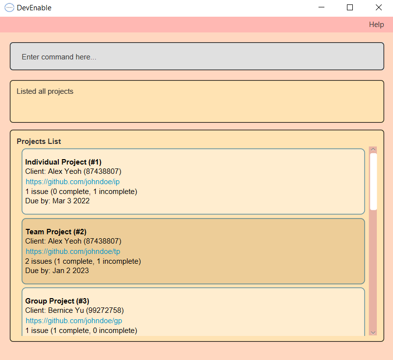

# User Guide

-------------------------------------------------------------------------------------------------------------------

DevEnable is a desktop app for managing developer projects, optimized for use via a Command Line Interface (CLI) while still having the benefits of a Graphical User Interface (GUI). If you can type fast, DevEnable can get your project management tasks done faster than traditional GUI apps.

-------------------------------------------------------------------------------------------------------------------

## Table of Contents(toc)

1. [Quick Start](#Set-Up)
2. [Features](#features)
3. [FAQ](#FAQ)
4. [Command summary](#summary)

--------------------------------------------------------------------------------------------------------------------

## Set-Up

1. Ensure you have Java `11` or above installed in your Computer.

2. Download the latest `devenable.jar` from [here](https://github.com/AY2223S1-CS2103-F13-1/tp).

3. Copy the file to the folder you want to use as the _home folder_ for your DevEnable.

4. Double-click the file to start the app. The GUI similar to the below should appear in a few seconds.  
   

5. Type the command in the command box and press Enter to execute it. e.g. typing **`help`** and pressing Enter will display a list of commands and functionalities. 
   Some example commands you can try:

   * **`list`** : Shows a list of all projects.

   * **`project -a`**`project -a n/ProjectX` : Adds a project named ProjectX to the list with a unique, autmatically-generated ID.

   * **`project -d`**`project -d 1` : Deletes the 1st project shown in the current list.

   * **`clear`** : Deletes all projects.

   * **`exit`** : Exits the app.

1. Refer to the [Features](#features) below for details of each command.

--------------------------------------------------------------------------------------------------------------------

## Features

**:information_source: Notes about the command format:** 

* Words in `UPPER_CASE` are the parameters to be supplied by the user. 
  e.g. in `PROJECT -a n/PROJECT_NAME`, `NAME` is a parameter which can be used as `add n/Orbital`.

* Items in square brackets are optional. 
  e.g `n/PROJECT_NAME [r/USERNAME/REPO_NAME]` can be used as `n/Orbital r/OrbitalTeam22` or as `n/Orbital`.

* Parameters can be in any order. 
  e.g. if the command specifies `n/PROJECT_NAME r/REPO_URL`, `r/REPO_URL n/PROJECT_NAME` is also acceptable.

* If a parameter is expected only once in the command but you specified it multiple times, only the last occurrence of the parameter will be taken. 
  e.g. if you specify `p/12341234 p/56785678`, only `p/56785678` will be taken.

* Extraneous parameters for commands that do not take in parameters (such as `help`, `list`, `exit` and `clear`) will be ignored. 
  e.g. if the command specifies `help 123`, it will be interpreted as `help`.

### Viewing help : `help`

Displays a list of commands and functionalities. 

Format: `help`

### Listing all projects : `list`

Shows a list of all projects.

Format: `list`

:bulb: **Tip:**
A person can have any number of tags (including 0)

### Adding a project : `project -a`

Adds a project to the application. A unique project ID will be automatically generated.

Format: `project -a n/PROJECT_NAME [r/USERNAME/REPO_NAME]`

:bulb: **Tip:**
A person can have any number of tags (including 0)

Examples:
* `project -a n/ProjectX`
* `project -a n/ProjectY r/AgentX/ProjectY`

### Editing a project : `project -e`

Edits a specified project.

Format: `project -e PROJECT_ID [n/PROJECT_NAME] [r/REPO_URL]`

* Edits the project with the specified `PROJECT_ID`. The index refers to the index number shown in the displayed person list. The index **must be a positive integer** 1, 2, 3, …​
* At least one of the optional fields must be provided.
* Existing values will be updated to the input values.
* When editing tags, the existing tags of the person will be removed i.e adding of tags is not cumulative.
* You can remove all the person’s tags by typing `t/` without
    specifying any tags after it.

Examples:
*  `project -e 1 n/ProjectX` 
*  `project -e 2 r/AgentY/ProjectY` 
*  `project -e 3 n/ProjectZ r/AgentZ/Project`

### Deleting a project : `project -d`

Deletes a project from the application.

Format: `project -d PROJECT_ID`

* Deletes the person at the specified `INDEX`.
* The index refers to the index number shown in the displayed person list.
* The index **must be a positive integer** 1, 2, 3, …​

Examples:
* `project -d 1`

### Tagging a client : `client -t`

Adds a project to the application. That is, adds the client to the project with the specified PROJECT_ID.

Format: `client -t PROJECT_ID n/CLIENT_NAME [p/CLIENT_CONTACT_NUMBER] [e/CLIENT_EMAIL]`

:bulb: **Tip:**
A person can have any number of tags (including 0)

Examples:
* `client -t 1 n/Amy`
* `client -t 2 n/Bob p/91234567`
* `client -t 3 n/Charlie e/charlie@gmail.com`
* `client -t 2 n/Dave p/91111111 e/dave@gmail.com`

### Editing a client : `client -e`

Edits the client for a specific project.

Format: `project -e PROJECT_ID [n/PROJECT_NAME] [r/REPO_URL]`

* Edits the project with the specified `PROJECT_ID`. The index refers to the index number shown in the displayed person list. The index **must be a positive integer** 1, 2, 3, …​
* At least one of the optional fields must be provided.
* When editing tags, the existing tags of the person will be removed i.e adding of tags is not cumulative.
* Edits the client of the project with the specified PROJECT_ID.
* At least one of the optional fields must be provided.
* Existing values will be updated to the input values.

Examples:
*  `client -e 1 n/Amy`
*  `client -e 2 n/Bob p/91234567`
*  `client -e 3 n/Charlie e/charlie@gmail.com`
*  `client -e 2 n/Dave p/91111111 e/dave@gmail.com`

### Deleting a project : `client -d`

Removes the client from a project.

Format: `client -d i/PROJECT_ID n/CLIENT_NAME`

* Deletes the client with the specified `CLIENT_NAME` under the specified `PROJECT_ID`.
* The index **must be a positive integer** 1, 2, 3, …​

Examples:
* `client -d 1 n/Amy`

### Tagging a deadline : `deadline -t`

Tags a deadline to a project with the specified PROJECT_ID.

Format: `deadline -t i/PROJECT_ID d/DATETIME`

:bulb: **Tip:**
DATETIME must be in the following format: yyyy-mm-dd

Examples:
* `deadline -t 1 2022-09-16`

### Editing a deadline : `deadline -e`

Removes a deadline to a project with the specified `PROJECT_ID`.

Format: `deadline -e i/PROJECT_ID d/NEW_DATETIME`

* DATETIME must be in the following format: yyyy-mm-dd

Examples:
*  `deadline -e 1 2022-09-16`

### Deleting a deadline : `deadline -d`

Removes a deadline to a project.

Format: `deadline -d i/PROJECT_ID`

Examples:
* `deadline -d 1`

### Exiting the program : `exit`

Exits the program.

Format: `exit`

### Saving the data

DevEnable data are saved in the hard disk automatically after any command that changes the data. There is no need to save manually.

### Editing the data file

DevEnable data are saved as a txt file `[JAR file location]/devenable.json`. Advanced users are welcome to update data directly by editing that data file.

:exclamation: **Caution:**
If your changes to the data file makes its format invalid, DevEnable will discard all data and start with an empty data file at the next run.

### Archiving data files `[coming in v2.0]`

_Details coming soon ..._

--------------------------------------------------------------------------------------------------------------------

## FAQ

**Q**: How do I transfer my data to another Computer? 
**A**: Install the app in the other computer and overwrite the empty data file it creates with the file that contains the data of your previous AddressBook home folder.

--------------------------------------------------------------------------------------------------------------------

## Summary

Action | Format, Examples
--------|------------------
**Add Project** | `project -a n/PROJECT_NAME [r/USERNAME/REPO_NAME]`
**Edit Project** | `project -e PROJECT_ID [n/PROJECT_NAME] [r/REPO_URL]`
**Delete Project** | `project -d PROJECT_ID`
**Tag Client** | `client -t PROJECT_ID n/CLIENT_NAME [p/CLIENT_CONTACT_NUMBER] [e/CLIENT_EMAIL]`
**Edit Client** | `client -e i/PROJECT_ID n/CLIENT_NAME [p/CLIENT_CONTACT_NUMBER] [e/CLIENT_EMAIL]`
**Delete Client** | `client -d i/PROJECT_ID n/CLIENT_NAME`
**Tag Deadline** | `deadline -t i/PROJECT_ID d/DATETIME`
**Edit Deadline** | `deadline -e i/PROJECT_ID d/NEW_DATETIME`
**Delete Deadline** | `deadline -d i/PROJECT_ID`
**List** | `list`
**Clear** | `clear`
**Help** | `help`
